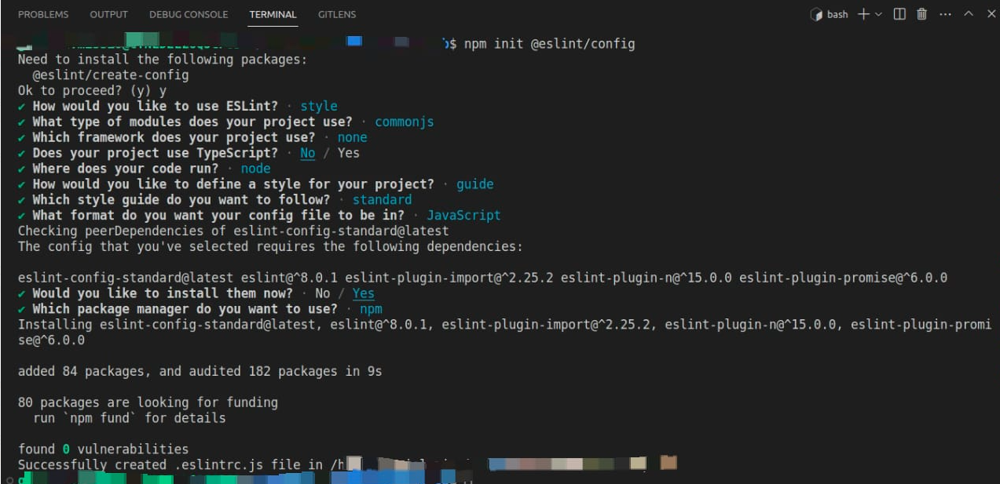

# Set Up Projects Like a Pro

## Sumário

- [NPM](#npm-node-package-manager)
- [Linting](#linting)
- [Git Hooks](#git-hooks)
- [Lint Staged](#lint-staged)
- [Gitignore](#gitignore)
- [Environment Variables](#environment-variables)
- [Clean Architecture](#clean-architecture)
- [Postman Collection](#postman-collection)
- [Docker-Compose (Local Database Setup)](#docker-compose)
- [Seeds](#seeds)

## Configuração Rápida

Está com pressa? Use alguns scripts para configurar rapidamente o seu projeto. Confira o [guia de configuração rápida]((./media/webinar/fast-setup-pt-br.md)) para mais detalhes.

## NPM (Node Package Manager)

O NPM é um gerenciador de pacotes para o ecossistema JavaScript. Ele permite instalar, gerenciar e compartilhar pacotes de código que podem ser usados em projetos Node.js. Além disso, pode ser usado para gerenciar dependências, executar scripts e definir detalhes importantes do projeto.

O arquivo `package.json` é o coração de qualquer projeto Node.js e é utilizado pelo NPM para instalar e gerenciar dependências. Aqui estão alguns detalhes importantes que você deve definir no `package.json`:

- **Name**: Nome do seu projeto.
- **Version**: Versão atual do projeto.
- **Description**: Breve descrição do projeto.
- **Dependencies**: Lista de pacotes necessários para o funcionamento do projeto.
- **DevDependencies**: Lista de pacotes necessários apenas para o desenvolvimento (como frameworks de teste e linters).

Para criar um arquivo "package.json" para o seu projeto, execute:

```Bash
npm init
```

Para instalar todas as dependências listadas no package.json, execute:

```Bash
npm install
```
Para instalar apenas as dependências de produção (ignorando as devDependencies), execute:

```Bash
npm install --omit=dev
```

## Linting

Linting é o processo de análise do código para identificar erros, violações de estilo e outras questões. Isso pode ser feito manualmente ou com ferramentas automatizadas chamadas linters.

No ecossistema JavaScript, o linter mais popular é o ESLint, uma ferramenta altamente configurável que permite definir regras e plugins específicos para cada projeto.

Para instalar o ESLint como dependência de desenvolvimento, execute:

```Bash
npm install -D eslint
```

Após a instalação, crie um arquivo de configuração .eslintrc com as regras desejadas. Você pode criar esse arquivo manualmente ou utilizar o comando interativo:

```Bash
npm init @eslint/config
```

Para verificar se há problemas no seu código, execute:

```Bash
npx eslint demo-file.js
```

Para corrigir automaticamente problemas identificados, execute:

```Bash
npx eslint demo-file.js --fix
```

Usar ESLint ajuda a manter a qualidade do código e evita erros comuns.

Exemplo de Configuração do ESLint



## Git Hooks

Os Git Hooks são scripts que são executados automaticamente em determinados eventos do Git, como commit e push. Eles permitem automatizar tarefas e garantir a qualidade do código antes de ser enviado para o repositório.

Uma das ferramentas mais populares para gerenciar Git Hooks é o Husky, que facilita a configuração e execução de hooks.

Para instalar o Husky, execute:

```Bash
npm install -D husky
```

Depois, inicialize o Husky no projeto:

```Bash
npx husky init
```

Agora, configure o hook "pre-commit" para rodar o ESLint antes de cada commit (sobrescrever script padrão)

```Bash
npx husky add .husky/pre-commit "npx eslint ."
```

## Lint-staged

O Lint-Staged é uma ferramenta que permite rodar linters apenas nos arquivos que foram modificados e adicionados ao Git (staged). Isso é útil para evitar verificações desnecessárias em todo o código.

Para instalar o Lint-Staged, execute:

```Bash
npm install -D lint-staged
```

Depois, crie o arquivo de configuração ".lintstagedrc" e defina as regras:

```Bash
npm pkg set scripts.lint="npx eslint"
touch .lintstagedrc
echo '{
  "*.js": "npm run lint"
}' > .lintstagedrc
```

## Gitignore

O arquivo .gitignore é usado para definir quais arquivos e pastas devem ser ignorados pelo Git, evitando que arquivos desnecessários ou sensíveis sejam versionados.

Exemplo de arquivos que normalmente devem ser ignorados:

- **node_modules/**: NDependências do projeto.
- **.env**: Arquivo contendo variáveis de ambiente. (potencialmente contendo valores sensives)
- ***.log**: Arquivos de log gerados pelo projeto.

Para criar um .gitignore, execute:

```Bash
touch .gitignore
echo 'node_modules' > .gitignore
echo '.env' >> .gitignore
```

## Variáveis de Ambiente

As variáveis de ambiente são uma forma de armazenar configurações do seu aplicativo fora do código-fonte, facilitando a implantação em diferentes ambientes sem a necessidade de modificar o código.

Para acessar variáveis de ambiente em um aplicativo Node.js, você pode usar o objeto process.env.
Por exemplo, se você tiver uma variável chamada DATABASE_URL, poderá acessá-la assim:

```Javascript
const databaseUrl = process.env.DATABASE_URL;
```

### O Arquivo .env

O arquivo .env é um arquivo de texto simples que contém pares chave-valor com as variáveis de ambiente.
Este arquivo não deve ser versionado no Git, pois pode conter informações sensíveis, como senhas e chaves de API.

Para usar um arquivo .env no seu projeto, você pode utilizar a biblioteca dotenvx.
Ela lê automaticamente o conteúdo do .env e define as variáveis de ambiente (é uma alternativa melhorada ao dotenv, recomendada pelo próprio criador do dotenv).

Para instalar o dotenvx como dependência de desenvolvimento, execute:

```Bash
npm install -D @dotenvx/dotenvx
```

Exemplo de um arquivo .env:

```
DATABASE_URL=mongodb://localhost/mydatabase
API_KEY=1234567890abcdef
```

Para carregar suas variáveis de ambiente no código Node.js:

```Javascript
// CommonJS
require('@dotenvx/dotenvx').config();

// ESM
import '@dotenvx/dotenvx/config';
```

No entanto, uma abordagem mais limpa e flexível é injetar variáveis de ambiente no momento da execução, sem precisar modificar o código:

```bash
dotenvx run -- node demo-file.js
```

Depois de executar esse comando, as variáveis estarão acessíveis normalmente pelo process.env.

### Por que ignorar arquivos .env?

É essencial adicionar arquivos .env ao .gitignore para evitar o vazamento de informações sensíveis no seu repositório.

Por exemplo, se você acidentalmente versionar um arquivo .env contendo a senha de um banco de dados, essa informação ficará exposta para qualquer pessoa com acesso ao repositório.

Ao adicionar arquivos .env ao .gitignore, você garante que eles não serão comprometidos acidentalmente.

## Clean Architecture

A Clean Architecture é um padrão arquitetural que promove a separação de responsabilidades dentro de um sistema, organizando-o em múltiplas camadas, cada uma com um propósito específico.
O objetivo principal da Clean Architecture é tornar o sistema mais sustentável e flexível ao longo do tempo, especialmente útil para aplicações de grande porte que precisam ser mantidas e evoluídas constantemente.

No coração da Clean Architecture está o princípio de desacoplamento. Isso significa que cada camada deve ser independente das outras, de modo que mudanças em uma camada não impactem as demais. Essa separação torna o código mais fácil de entender, testar e modificar.

A arquitetura geralmente é dividida nas seguintes camadas:

- **Camada de Apresentação (Presentation Layer)**: Responsável por lidar com a entrada e saída do usuário, como páginas web, views e controllers. Ela se comunica com a camada de domínio através de interfaces e traduz as interações do usuário em conceitos do domínio.

- **Camada de Infraestrutura (Infrastructure Layer)**: Contém detalhes técnicos do sistema, como conexões com bancos de dados, serviços externos e o sistema de arquivos. Essa camada implementa as interfaces definidas pela camada de domínio.

- **Camada de Domínio (Domain Layer)**: Contém a lógica de negócios do sistema. Aqui ficam as entidades, casos de uso e serviços relacionados ao domínio.

- **Camada Principal (Main Layer)** Responsável por orquestrar a interação entre as outras camadas. Geralmente contém o código de inicialização da aplicação e a injeção de dependências que conecta as camadas.

### Benefícios da Clean Architecture:
* Maior flexibilidade: Como as camadas são independentes, você pode modificar uma parte do sistema sem afetar o resto.
* Facilidade de manutenção: O código se torna mais modular, permitindo testes e refatorações sem comprometer toda a aplicação.
* Evolução do sistema: A separação de responsabilidades permite que novas funcionalidades sejam adicionadas sem criar um efeito cascata de mudanças.

## Coleção do Postman

O Postman é uma ferramenta muito utilizada para desenvolvimento e testes de APIs, permitindo o envio de requisições e a visualização das respostas de forma amigável.

Uma coleção do Postman é um conjunto de requisições organizadas que pode ser compartilhado entre membros do time.
Abaixo, explicamos como exportar e importar coleções no Postman.

### Exportando uma Coleção do Postman

1. Abra a coleção desejada no Postman.
2. Clique no botão  "..." no canto superior direito da tela.
3. Selecione "Export" no menu suspenso.
4. Escolha o formato desejado (Postman Collection v1 ou Postman Collection v2) e clique em "Exportar".
5. Salve o arquivo no seu computador.

### Importando uma Coleção no Postman

1. Abra o Postman e clique no botão "Importar" no canto superior esquerdo.
2. Selecione o arquivo da coleção exportada.
3. Escolha o formato desejado (Postman Collection v1 ou Postman Collection v2) e clique em "Importar".
4. A coleção estará disponível no seu workspace.

Utilizar coleções no Postman facilita o compartilhamento de requisições entre a equipe e ajuda a manter a consistência nos testes da API.

## Docker Compose

O Docker Compose é uma ferramenta que permite definir e executar aplicações multi-container.
Com ele, você pode configurar e iniciar múltiplos containers necessários para o seu projeto, gerenciando suas dependências e comunicação de forma simples.

### Executando um Banco de Dados Local com Docker Compose
Um caso de uso comum do Docker Compose é a execução de um banco de dados local para desenvolvimento.
Por exemplo, se o seu projeto utiliza MongoDB, você pode usar o Docker Compose para rodar um container MongoDB e conectá-lo à sua aplicação.

Para isso, crie um arquivo docker-compose.yml na raiz do seu projeto com o seguinte conteúdo:

```Yml
version: '3.1'

services:
  mongo:
    image: mongo
    restart: always
    ports:
      - 27017:27017
```

Neste arquivo:
* Criamos um serviço chamado mongo, que utiliza a imagem oficial mongo do Docker Hub.
* Definimos restart: always para que o container seja reiniciado automaticamente se falhar.
* Mapeamos a porta 27017 do container para a mesma porta no host.

Para iniciar o container, basta rodar:

```Bash
docker-compose up
```

Isso iniciará o MongoDB e exibirá os logs no terminal.
Para interromper a execução, pressione Ctrl + C.

## Seeds

No contexto de bancos de dados, seeds são scripts que inserem dados iniciais no banco.
Eles são úteis para testes ou para preparar um ambiente de desenvolvimento com dados pré-definidos.

Seeds geralmente contêm informações estáticas, como usuários padrão, configurações iniciais ou categorias pré-definidas.
Esses dados são adicionados uma única vez durante a configuração do projeto.
