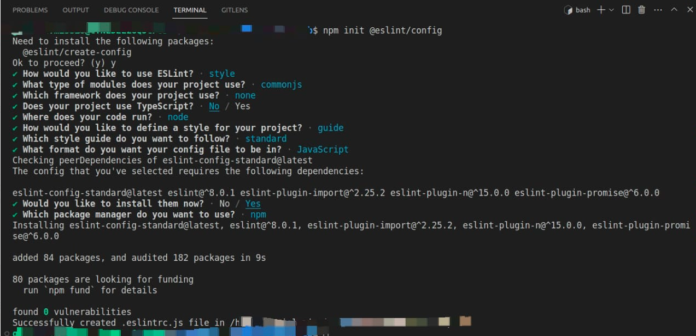

# Set Up Projects Like a Pro

## Summary

- [NPM](#npm-node-package-manager)
- [Linting](#linting)
- [Git Hooks](#git-hooks)
- [Lint Staged](#lint-staged)
- [Gitignore](#gitignore)
- [Environment Variables](#environment-variables)
- [Clean Architecture](#clean-architecture)
- [Postman Collection](#postman-collection)
- [Docker-Compose (Local Database Setup)](#docker-compose)
- [Seeds](#seeds)

## Fast Setup

Are you in a hurry? Use some scripts to quickly set up your project. Check out the [Fast Setup](./media/webinar/fast-setup.md) guide for more information.

## NPM (Node Package Manager)

NPM is a package manager for the JavaScript ecosystem. It allows you to install, manage, and share packages of JavaScript code that can be used in Node.js projects. You can use it to manage dependencies, run scripts, and define important project details.

The `package.json` file is the heart of every Node.js project, and it's used by NPM to install and manage dependencies. Here are some important details that you should define in your `package.json` file:

- **Name**: The name of your project.
- **Version**: The current version of your project.
- **Description**: A brief description of your project.
- **Dependencies**: The list of packages that your project depends on to work properly.
- **DevDependencies**: The list of packages that are only needed during development, such as testing frameworks and linters.

To create a "package.json" file for your project, you can run the following command in your project directory:

```Bash
npm init
```

To install dependencies listed in the "package.json" file, you can run the following command:

```Bash
npm install
```

This command will download and install all dependencies listed in the "dependencies" and "devDependencies" sections of the "package.json" file

To install only "dependencies" you can run the following command:

```Bash
npm install --production --no-optional
```

## Linting

Linting is the process of analyzing the code for potential errors, coding style violations, and other issues. It can be done manually or using automated tools called "linters".

In JavaScript, the most popular linter is ESLint. It is a pluggable linting utility that allows you to customize the rules and plugins to suit your project's needs.

ESLint comes with a set of default rules that cover common mistakes and best practices. You can also configure ESLint to use plugins that provide additional rules for specific frameworks or libraries.

To use ESLint in your project, you need to install it as a development dependency:

```Bash
npm install -D eslint
```

After installing ESLint, you need to create a configuration file named .eslintrc. This file contains the rules and plugins that you want to use for your project. You can create this file manually or by running the following command:

```Bash
npm init @eslint/config
```

It will guide you through a series of questions to help you configure your .eslintrc file.

Once you have created your .eslintrc file, you can run ESLint on your JavaScript files using the following command:

```Bash
npx eslint demo-file.js
```

ESLint will analyze your code and report any errors or warnings that it finds. You can also configure ESLint to automatically fix some of the issues that it finds by running the following command:

```Bash
npx eslint demo-file.js --fix
```

This will fix the issues that ESLint can automatically fix and report the remaining issues.

By using ESLint in your project, you can ensure that your code is consistent, follows best practices, and is free from common errors and bugs.

ESLint config demo



## Git Hooks

Git Hooks are scripts that run automatically whenever a particular Git event occurs, such as committing or pushing changes. They allow you to automate certain tasks and enforce code quality standards.

One popular library for managing Git Hooks is Husky. Husky provides an easy-to-use interface for setting up hooks, and it comes preconfigured with several commonly used hooks, such as the pre-commit hook.

To use Husky in your project, you need to install it as a development dependency:

```Bash
npm install -D husky
```

After installing Husky, let's add an "prepare" script in your package.json:

```Bash
npm pkg set scripts.prepare="husky install"
npm run prepare
```

Finnaly, it's time to setup your "pre-commit" hook

```Bash
npx husky add .husky/pre-commit "npx eslint ."
```

## Lint-staged

Lint-staged is a tool that allows you to run linters on specific files that you've staged in Git. This is particularly useful when working with a large codebase, as it enables you to focus on only the files that you've changed, and ensure that the code you commit is of high quality.

To use Lint-staged in your project, you need to install it as a development dependency:

```Bash
npm install -D lint-staged
```

After installing Lint-staged, let's create a ".lintstagedrc" file to keep Lint-staged config:

```Bash
npm pkg set scripts.lint="npx eslint"
touch .lintstagedrc
echo '{
  "*.js": "npm run lint"
}' > .lintstagedrc
```

## Gitignore

The .gitignore file is used to specify intentionally untracked files that Git should ignore. This is useful when working on projects with files that should not be committed to version control.

When you add files to your .gitignore, Git will no longer track them or include them in commits. This can be helpful for files that are generated automatically by your project, such as log files or compiled binaries.

Here are some examples of files and directories that you may want to ignore in your projects:

- **node_modules/**: Node.js packages installed via npm or yarn
- **.env**: Environment files containing sensitive information
- ***.log**: Log files generated by your project

It's important to note that the .gitignore file only applies to untracked files. If you've already committed a file to Git, adding it to your .gitignore file will not remove it from your repository. You'll need to manually remove the file from your repository with git rm to completely delete it.

To create a .gitignore file, simply create a file named .gitignore at the root of your project and list the files and directories you want to ignore, one per line. Here's an example:

```Bash
touch .gitignore
echo 'node_modules' > .gitignore
echo '.env' >> .gitignore
```

## Environment Variables

Environment variables are a way to store configuration data outside of your codebase, making it easier to deploy your app to different environments without modifying your source code.

To use environment variables in your Node.js app, you can access them using the process.env object.

For example, if you have an environment variable named DATABASE_URL, you can access its value like this:

```Javascript
const databaseUrl = process.env.DATABASE_URL;
```

To set environment variables, you can use the command line or a .env file.

### The .env File

The .env file is a simple text file that contains key-value pairs of environment variables. It is not meant to be checked into version control, as it may contain sensitive information like passwords and API keys.

To use the .env file in your app, you can use the dotenv library. dotenv reads the contents of your .env file and sets the environment variables automatically.

To use .env file in your project, you need to install it dotenv as a development dependency:

```Bash
npm install -D dotenv
```

For example, if you have the following .env file:

```
DATABASE_URL=mongodb://localhost/mydatabase
API_KEY=1234567890abcdef
```

You can load its contents in your Node.js app like this:

```Javascript
if (process.env.IS_LOCALHOST) require('dotenv').config();
```

After this call, you can access the variables from the process.env object as usual:

### Why Ignore .env Files?
It is important to add .env files to your .gitignore file to avoid accidentally committing sensitive information to your version control system.

For example, if you accidentally commit an .env file that contains a database password, that password could be exposed to everyone who has access to the repository.

By adding .env files to your .gitignore file, you can ensure that they are not accidentally committed to your repository.

## Clean Architecture

Clean Architecture is an architectural pattern that promotes the separation of concerns by dividing software systems into multiple layers, each with a specific responsibility. The primary goal of Clean Architecture is to make a system maintainable and flexible over time. It is especially useful for large-scale applications that require ongoing development and maintenance.

At the heart of Clean Architecture is the principle of decoupling. This means that each layer of the application should be independent of the others, so that changes made in one layer don't impact the others. This separation of concerns is essential for creating a system that is easy to understand, test, and modify.

There are several layers in a typical Clean Architecture:

- **Presentation Layer**: This layer is responsible for handling user input and output. It consists of UI components such as web pages, views, and controllers. This layer communicates with the Domain layer through interfaces and is responsible for translating user input and output into domain concepts.

- **Infrastructure Layer**: This layer is responsible for providing the technical details of the system. It includes components such as databases, external services, and the file system. This layer is responsible for providing implementations for the interfaces defined in the Domain layer.

- **Domain Layer**: This layer contains the business logic of the application. It is responsible for the entities, use cases, and domain services of the system.

- **Main Layer** This layer coordinates the interaction between the other layers. It is responsible for starting up the application and wiring the different layers together. It may contains the dependency injection code that glues the different layers together.

One of the benefits of Clean Architecture is that it allows for flexibility and adaptability. Because each layer is independent, changes can be made in one layer without affecting the others. This means that the system can be modified and updated without risking the stability of the entire application.

## Postman Collection

Postman is a popular tool used for API development and testing. It provides a user-friendly interface for sending requests to APIs and inspecting the responses.

A Postman collection is a group of requests that can be organized into folders and shared among team members. In this section, we'll cover how to import and export a Postman collection.

### Exporting a Postman Collection

To export a Postman collection, follow these steps:

1. Open the collection you want to export in Postman.
2. Click the "..." button in the top-right corner of the screen.
3. Select "Export" from the dropdown menu.
4. Choose the desired format (Postman Collection v1, Postman Collection v2, etc.) and click "Export".
5. Save the exported file to your local machine.

### Importing a Postman Collection

To import a Postman collection, follow these steps:

1. Open Postman and click the "Import" button in the top-left corner of the screen.
2. Select the exported file you want to import.
3. Choose the desired format (Postman Collection v1, Postman Collection v2, etc.) and click "Import".
4. The collection will now be available in your Postman workspace.
5. By using Postman collections, you can easily share API requests and ensure consistency among team members.

## Docker Compose

Docker Compose is a tool that allows you to define and run multi-container Docker applications. With Docker Compose, you can configure and start multiple containers that are part of your application, and manage their dependencies and networking.

### Running a local development database with Docker Compose

One common use case for Docker Compose is running a local development database. For example, if your application uses MongoDB, you can use Docker Compose to start a MongoDB container and connect your application to it.

To do this, you need to create a docker-compose.yml file in the root directory of your project. Here's an example configuration for a MongoDB container:

```Yml
version: '3.1'

services:
  mongo:
    image: mongo
    restart: always
    ports:
      - 27017:27017
```

In this configuration, we define a service called mongodb, which uses the mongo image from Docker Hub. We also specify that the container should always be restarted if it fails (restart: always), and we map the container's port 27017 to the host's port 27017 (ports: - '27017:27017').

To start the container, run the following command in the same directory as your docker-compose.yml file:

```Bash
docker-compose up
```

This will start the MongoDB container and output its logs to the console. You can stop the container by pressing Ctrl+C.

## Seeds

In the context of database management, "seeds" are scripts that populate a database with initial data. This can be useful for testing or setting up a development environment. Seeds usually contain static data, such as default settings or test users, that are added to the database once during the initial setup.
